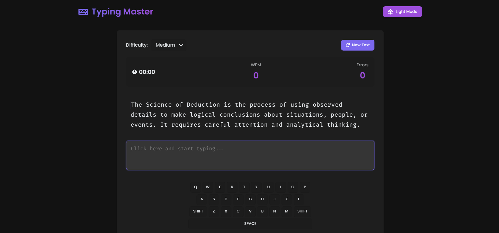

# Typing Master - Interactive Typing Test Application

A modern, feature-rich typing test application built with React that helps users improve their typing speed and accuracy.



## Features

- **Real-time Typing Analysis**

  - Words Per Minute (WPM) calculation
  - Accuracy percentage tracking
  - Error counting
  - Time elapsed monitoring

- **Multiple Difficulty Levels**

  - Easy
  - Medium
  - Hard
  - Adjusts scoring based on difficulty selected

- **Performance Scoring**

  - Overall score out of 100
  - Score calculation based on:
    - WPM (60% weight)
    - Accuracy (40% weight)
    - Difficulty multiplier

- **Visual Feedback**

  - Animated circular progress indicator
  - Performance messages based on score
  - Trophy icon for achievement recognition
  - Clean, modern UI with gradient effects

- **Test History**

  - Saves previous test results
  - View historical performance
  - Track improvement over time
  - Timestamp for each test attempt

- **Sharing Capabilities**

  - Share results via native share API
  - Clipboard fallback for unsupported browsers
  - Custom formatted share message

- **Responsive Design**
  - Mobile-friendly interface
  - Adapts to different screen sizes
  - Consistent experience across devices

## Technical Implementation

Built using:

- React
- Framer Motion for animations
- React Icons
- CSS3 with modern features:
  - Flexbox/Grid layouts
  - CSS variables
  - Backdrop filters
  - Linear gradients

## Getting Started

1. Clone the repository:

   ```bash
   git clone https://github.com/yourusername/typing-master.git
   cd typing-master
   ```

2. Install dependencies:

   ```bash
   npm install
   ```

3. Start the development server:

   ```bash
   npm start
   ```

## Usage

Once the development server is running, open your browser and navigate to `http://localhost:3000` to access the Typing Master application. Follow the on-screen instructions to start a typing test.

## Contributing

We welcome contributions! Please follow these steps to contribute:

1. Fork the repository.
2. Create a new branch (`git checkout -b feature/YourFeature`).
3. Make your changes and commit them (`git commit -m 'Add some feature'`).
4. Push to the branch (`git push origin feature/YourFeature`).
5. Open a pull request.

## License

This project is licensed under the MIT License - see the [LICENSE](LICENSE) file for details.
